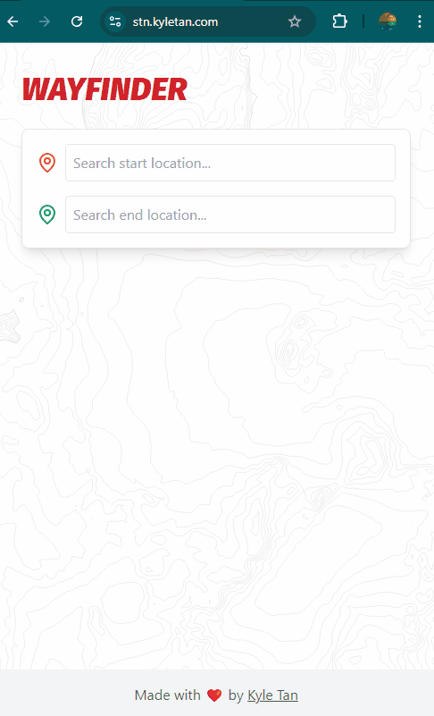

# Pathfinding Visualizer



This application allows users to visualize the shortest path between two points on a multi-floor map.

## Features

- Interactive map visualization
- Multi-floor navigation
- Shortest path calculation and display
- Dynamic floor switching
- Start and end point selection

## Technologies Used

- [Next.js](https://nextjs.org/) - React framework for production
- [React](https://reactjs.org/) - JavaScript library for building user interfaces
- [TypeScript](https://www.typescriptlang.org/) - Typed superset of JavaScript
- [Tailwind CSS](https://tailwindcss.com/) - Utility-first CSS framework
- [Framer Motion](https://www.framer.com/motion/) - Animation library for React
- [Jest](https://jestjs.io/) - JavaScript Testing Framework
- [React Testing Library](https://testing-library.com/docs/react-testing-library/intro/) - Testing utilities for React
- [Azure Container Apps](https://azure.microsoft.com/en-us/services/container-apps/) - Serverless container hosting platform
- [GitHub Actions](https://github.com/features/actions) - CI/CD automation tool

## Getting Started

### Prerequisites

- Node.js (version 20 or later)
- npm or yarn

### Installation

1. Clone the repository:
   ```bash
   git clone https://github.com/your-username/pathfinding-visualizer.git
   cd pathfinding-visualizer
   ```

2. Install dependencies:
   ```bash
   npm install
   # or
   yarn install
   ```

3. Run the development server:
   ```bash
   npm run dev
   # or
   yarn dev
   ```

4. Open [http://localhost:3000](http://localhost:3000) with your browser to see the result.

## Development

To start development, run the following command:

```bash
npm run dev
# or
yarn dev
```

This will start the development server with hot-reloading enabled.

## Usage

1. Open the application in your web browser.
2. Select a start location from the dropdown menu.
3. Select an end location from the dropdown menu.
4. The application will automatically calculate and display the shortest path.
5. Use the floor buttons to switch between different floors and view the path.

## Deployment

To deploy the application, follow these steps:

1. Build the production version:
   ```bash
   npm run build
   # or
   yarn build
   ```

2. Start the production server:
   ```bash
   npm start
   # or
   yarn start
   ```

## Project Structure

The project structure is organized as follows:

- `__tests__/`: Contains test files, including pathfinding tests
- `public/`: Stores static assets like images
- `src/`: Main source code directory
  - `app/`: Next.js app directory with layout and page components
  - `components/`: React components, including UI elements and visualizers
  - `data/`: JSON data files
  - `types/`: TypeScript type definitions
  - `utils/`: Utility functions (e.g. for pathfinding and graph operations)
- `Dockerfile`: Configuration for Docker containerization
- `docker-compose.yml`: Docker Compose configuration
- Configuration files: Various config files for Next.js, TypeScript, Jest, etc.

## Testing

Run the test suite with:

```bash
npm test
# or
yarn test
```

## Acknowledgements

- [Next.js Documentation](https://nextjs.org/docs)
- [React Documentation](https://reactjs.org/docs/getting-started.html)
- [TypeScript Documentation](https://www.typescriptlang.org/docs/)
- [Tailwind CSS Documentation](https://tailwindcss.com/docs)
- [Framer Motion Documentation](https://www.framer.com/docs/)
- [Jest Documentation](https://jestjs.io/docs/getting-started)
- [React Testing Library Documentation](https://testing-library.com/docs/react-testing-library/intro/)
